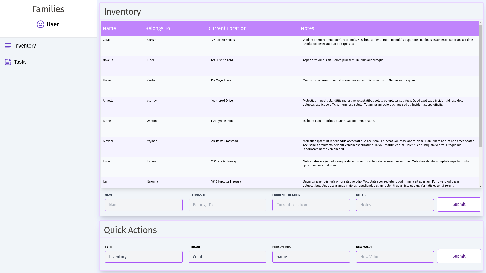
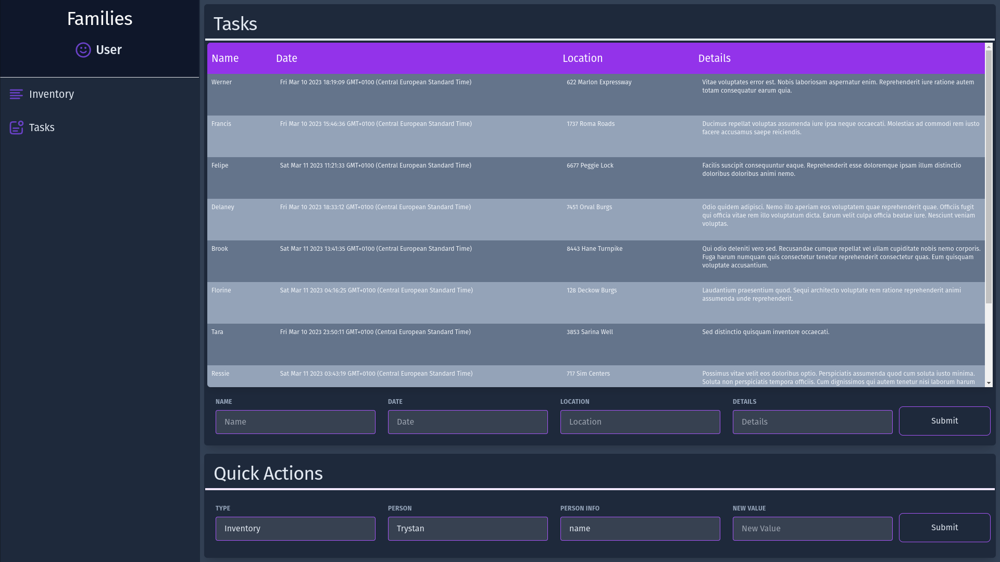

# Dashboard

Simple Dashboard created with Typescript and React

## Table of contents

- [General Info](#general-info)
- [Technologies Used](#technologies-used)
- [Features](#features)
- [Screenshots](#screenshots)
- [Setup](#setup)
- [Project Status](#project-status)
- [Room for Improvement](#room-for-improvement)
- [To do](#to-do)
- [Contact](#contact)

## General Info

This project was created to allow me to build a project using Typescript.

The inspiration was for families to organise tasks and keep track of important documents such as passports.

## Technologies Used

Project is created with:

- Typescript 4.6
- React 18.2
- Vite 3.2
- Tailwind 3.2
- Vitest 0.25

## Features

- Light/dark mode
- An inventory of important items and documents
- A list of tasks to be completed
- Quick actions allow any task or item in inventory to be updated

## Screenshots





## Setup

main channel has 'working' version
dev channel has more up to date code and features. However code may be incomplete, or not run at all.

To run this project, install it locally using npm:

```
$ cd ../dashboard
$ npm install
$ npm run dev
```

## Project Status

Project is: _in progress_

## Room for Improvement

- More consistency with modular component design
- Typescript types needs to be improved

#### To Do:

- Improve Types and type errors
- refactor

## Contact

Created by me - feel free to contact me!
